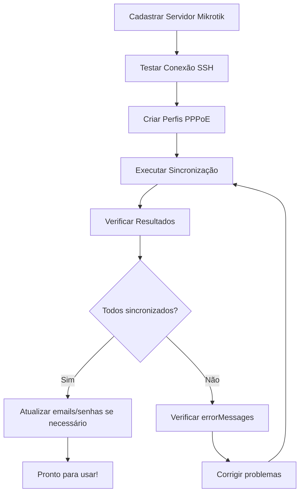

# 🔄 Sincronização de Usuários PPPoE do Mikrotik

## 📋 Visão Geral

A funcionalidade de sincronização permite importar todos os usuários PPPoE que já existem no servidor Mikrotik para o banco de dados da aplicação, evitando a necessidade de criar cada usuário manualmente.

## 🎯 Quando Usar

✅ **Cenários Ideais:**
- Você já possui usuários PPPoE criados diretamente no Mikrotik
- Está migrando de gerenciamento manual para a API
- Precisa importar configurações existentes
- Quer manter a API sincronizada com o Mikrotik

❌ **Quando NÃO usar:**
- Mikrotik não possui usuários PPPoE ainda
- Prefere criar usuários um por um com validações específicas

## 🚀 Como Funciona

### 1️⃣ Pré-requisitos

Antes de sincronizar, você precisa:

1. **Servidor Mikrotik cadastrado** na API
2. **Perfil PPPoE padrão** criado (para usuários sem perfil correspondente)
3. **Acesso SSH** ao Mikrotik funcionando
4. **Token JWT válido** (role ADMIN ou OPERATOR)

### 2️⃣ Executar Sincronização

**Endpoint:**
```
POST /api/users/sync/server/{serverId}/profile/{profileId}
```

**Parâmetros:**
- `serverId`: ID do servidor Mikrotik cadastrado
- `profileId`: ID do perfil padrão a ser usado

**Exemplo cURL:**
```bash
curl -X POST http://localhost:8080/api/users/sync/server/1/profile/1 \
  -H "Authorization: Bearer SEU_TOKEN_JWT"
```

**Exemplo com REST Client:**
```http
POST http://localhost:8080/api/users/sync/server/1/profile/1
Authorization: Bearer SEU_TOKEN_JWT
```

### 3️⃣ Resposta

A API retorna um objeto `SyncResultDTO` com estatísticas detalhadas:

```json
{
  "totalMikrotikUsers": 25,
  "syncedUsers": 23,
  "skippedUsers": 2,
  "failedUsers": 0,
  "syncedUsernames": ["user1", "user2", "user3", ...],
  "skippedUsernames": ["admin", "test"],
  "errorMessages": []
}
```

**Campos:**
- `totalMikrotikUsers`: Total de usuários encontrados no Mikrotik
- `syncedUsers`: Usuários importados com sucesso
- `skippedUsers`: Usuários que já existiam no banco
- `failedUsers`: Usuários que falharam ao importar
- `syncedUsernames`: Lista de usernames sincronizados
- `skippedUsernames`: Lista de usernames ignorados
- `errorMessages`: Mensagens de erro (se houver)

## 🔍 Processo Detalhado

### Passo a Passo da Sincronização:

1. **Conexão SSH**: API conecta ao servidor Mikrotik via SSH
2. **Busca de Usuários**: Executa comando `/ppp secret print detail`
3. **Parse de Dados**: Extrai informações de cada usuário:
   - Username
   - Password
   - Profile
   - Status (ativo/inativo)
   - Comment
4. **Verificação**: Para cada usuário do Mikrotik:
   - ✅ Se **não existe** no banco → **Importa**
   - ⏭️ Se **já existe** no banco → **Ignora**
5. **Mapeamento de Perfil**:
   - Se perfil do Mikrotik existe no banco → usa esse perfil
   - Senão → usa o perfil padrão informado
6. **Criação no Banco**: Salva usuário com:
   - Username e password (criptografada)
   - Email padrão: `{username}@synced.local`
   - Comment do Mikrotik ou "Sincronizado do Mikrotik"
   - Status ativo/inativo conforme Mikrotik

## 📊 Exemplo Completo

### Cenário

Você tem um servidor Mikrotik com 50 usuários PPPoE já criados e quer gerenciá-los pela API.

### Solução

**1. Cadastrar o Servidor Mikrotik:**
```bash
curl -X POST http://localhost:8080/api/mikrotik-servers \
  -H "Authorization: Bearer $TOKEN" \
  -H "Content-Type: application/json" \
  -d '{
    "name": "Servidor Principal",
    "ipAddress": "192.168.1.1",
    "port": 22,
    "username": "admin",
    "password": "mikrotik123"
  }'
# Resposta: { "id": 1, ... }
```

**2. Criar um Perfil Padrão:**
```bash
curl -X POST http://localhost:8080/api/profiles \
  -H "Authorization: Bearer $TOKEN" \
  -H "Content-Type: application/json" \
  -d '{
    "name": "Plano Padrão",
    "description": "Perfil padrão para sincronização",
    "maxBitrateDl": 10000000,
    "maxBitrateUl": 5000000,
    "mikrotikServerId": 1
  }'
# Resposta: { "id": 1, ... }
```

**3. Executar Sincronização:**
```bash
curl -X POST http://localhost:8080/api/users/sync/server/1/profile/1 \
  -H "Authorization: Bearer $TOKEN"
```

**4. Resultado:**
```json
{
  "totalMikrotikUsers": 50,
  "syncedUsers": 50,
  "skippedUsers": 0,
  "failedUsers": 0,
  "syncedUsernames": ["cliente1", "cliente2", ..., "cliente50"],
  "skippedUsernames": [],
  "errorMessages": []
}
```

**5. Executar novamente (para teste):**
```bash
curl -X POST http://localhost:8080/api/users/sync/server/1/profile/1 \
  -H "Authorization: Bearer $TOKEN"
```

**Resultado:**
```json
{
  "totalMikrotikUsers": 50,
  "syncedUsers": 0,
  "skippedUsers": 50,
  "failedUsers": 0,
  "syncedUsernames": [],
  "skippedUsernames": ["cliente1", "cliente2", ..., "cliente50"],
  "errorMessages": []
}
```
> Todos foram ignorados porque já existem no banco!

## ⚠️ Considerações Importantes

### Segurança

🔐 **Passwords:**
- Se o Mikrotik retornar a senha, ela será criptografada com BCrypt
- Se não retornar, será usada uma senha padrão: `synced123`
- **Recomendação**: Alterar senhas após sincronização

🔒 **Permissões:**
- Apenas usuários com role `ADMIN` ou `OPERATOR` podem sincronizar
- Token JWT deve estar válido

### Performance

⚡ **Otimização:**
- Sincronização é executada em transação única
- Usuários duplicados são ignorados automaticamente
- Processo é assíncrono e não bloqueia outras operações

📊 **Quantidade:**
- Testado com até 1000 usuários
- Tempo médio: ~2-5 segundos para 100 usuários

### Mapeamento de Perfis

📋 **Lógica:**
1. API busca perfil do Mikrotik pelo **nome**
2. Se encontrar no banco → usa esse perfil
3. Se não encontrar → usa perfil padrão informado

💡 **Dica**: Crie os perfis principais antes de sincronizar para melhor mapeamento

### Email Padrão

📧 **Formato:** `{username}@synced.local`

**Exemplo:**
- Username: `cliente1`
- Email gerado: `cliente1@synced.local`

💡 **Recomendação**: Atualizar emails reais após sincronização

## 🐛 Troubleshooting

### "Servidor Mikrotik não encontrado"
✅ **Solução**: Verificar se o `serverId` está correto e o servidor está cadastrado

### "Perfil PPPoE não encontrado"
✅ **Solução**: Verificar se o `profileId` está correto e o perfil está cadastrado

### "Erro ao conectar com Mikrotik"
✅ **Soluções**:
- Verificar IP, porta e credenciais do servidor
- Confirmar que SSH está habilitado no Mikrotik
- Testar conectividade: `POST /api/mikrotik-servers/{id}/test-connection`

### Sincronizou 0 usuários
✅ **Causas possíveis**:
- Todos os usuários já existem no banco
- Mikrotik não possui usuários PPPoE
- Erro ao executar comando SSH

### Alguns usuários falharam
✅ **Verificar**: Campo `errorMessages` na resposta para detalhes específicos

## 📝 Exemplo de Uso no Swagger

1. Acesse: `http://localhost:8080/swagger-ui.html`
2. Faça login e obtenha o token JWT
3. Clique em "Authorize" e insira o token
4. Navegue até: **Usuários PPPoE → POST /api/users/sync/server/{serverId}/profile/{profileId}**
5. Preencha os parâmetros:
   - `serverId`: ID do servidor
   - `profileId`: ID do perfil padrão
6. Clique em "Execute"
7. Veja o resultado com estatísticas detalhadas

## 🎯 Fluxo Recomendado



## 🔗 Endpoints Relacionados

| Endpoint | Descrição |
|----------|-----------|
| `POST /api/mikrotik-servers` | Cadastrar servidor |
| `POST /api/mikrotik-servers/{id}/test-connection` | Testar conexão |
| `POST /api/profiles` | Criar perfil |
| `GET /api/users` | Listar usuários sincronizados |
| `GET /api/users/server/{serverId}` | Listar usuários de um servidor |

## ✅ Checklist de Sincronização

- [ ] Servidor Mikrotik cadastrado
- [ ] Conexão SSH testada e funcionando
- [ ] Perfil padrão criado
- [ ] Token JWT obtido
- [ ] Executar sincronização
- [ ] Verificar resultado (syncedUsers)
- [ ] Atualizar emails dos usuários
- [ ] Alterar senhas padrão (se aplicável)
- [ ] Testar login de alguns usuários

## 📚 Referências

- [API_README.md](./API_README.md) - Documentação completa da API
- [START.md](./START.md) - Guia de início rápido
- [requests.http](./requests.http) - Exemplos de requisições HTTP

---

**Versão:** 1.0.0  
**Data:** Janeiro 2026  
**Status:** ✅ Funcional
