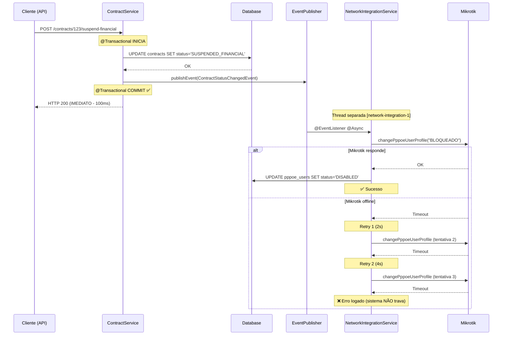

# 🏗️ Arquitetura Atual do Sistema - ISP Management

**Status**: ✅ Implementado e em operação  
**Última atualização**: 2026-02-16  
**Tipo**: Modular Monolith (Pragmático)

---

## 📋 Visão Geral

Este documento descreve a **arquitetura REAL e implementada** do sistema (não a idealizada).

### Decisão Arquitetural Principal

> **Monólito Modular Organizado por Features**  
> **Objetivo**: Código organizado, fácil de manter, preparado para evolução futura, sem complexidade prematura.

---

## 🎯 Estrutura do Projeto

```
src/main/java/br/com/mikrotik/
│
├── features/                    ← Módulos de negócio (10 features)
│   ├── auth/                    ← Autenticação e autorização
│   ├── companies/               ← Multi-tenant (Empresas)
│   ├── customers/               ← Gestão de clientes
│   ├── contracts/               ← Contratos e planos
│   ├── invoices/                ← Faturamento recorrente
│   ├── financial/               ← Fluxo de caixa
│   ├── network/                 ← Infraestrutura Mikrotik/PPPoE
│   │   ├── server/              ← Servidores Mikrotik
│   │   ├── pppoe/               ← Usuários e perfis PPPoE
│   │   ├── ippool/              ← Pools de IP
│   │   └── service/             ← NetworkIntegrationService (NOVO)
│   ├── dashboard/               ← Estatísticas e métricas
│   ├── sync/                    ← Sincronização full
│   └── automation/              ← Logs de automação
│
└── shared/                      ← Código compartilhado
    ├── constant/                ← Constantes
    ├── dto/                     ← DTOs genéricos (PageResponse)
    ├── model/                   ← Entidades compartilhadas (AuditLog)
    ├── repository/              ← Repositories compartilhados
    ├── util/                    ← Utilitários (CompanyContextHolder, DocumentValidator)
    └── infrastructure/
        ├── config/              ← Configurações Spring (Security, CORS, Async)
        └── dto/exception/       ← Exceções customizadas
```

---

## 📦 Estrutura Interna de uma Feature

Cada feature segue o padrão **Package by Layer** (camadas técnicas):

```
features/contracts/
├── controller/          ← REST Controllers (@RestController)
├── service/            ← Lógica de negócio (@Service)
├── repository/         ← Acesso a dados (Spring Data JPA)
├── model/              ← Entidades JPA (@Entity)
├── dto/                ← DTOs de entrada/saída
├── event/              ← Eventos de domínio (NOVO)
└── job/                ← Jobs agendados (@Scheduled)
```

**Por que não Hexagonal Architecture?**
- ❌ Complexidade prematura para 1 desenvolvedor
- ❌ Overhead de manutenção sem benefício imediato
- ✅ Estrutura atual é suficiente para 95% dos casos
- ✅ Se precisar de microserviços, cada `feature/` vira um serviço

---

## 🔄 Arquitetura de Integrações Assíncronas (CRÍTICO)

### Problema Resolvido

**Antes**: Integrações com Mikrotik dentro de `@Transactional` causavam:
- Connection Pool Exhaustion
- Timeouts de requisição HTTP
- Sistema travado se Mikrotik offline

**Agora**: Arquitetura baseada em **Eventos + Processamento Assíncrono**

---

### Fluxo de Suspensão de Contrato (Exemplo)



---

## 🧩 Componentes Críticos

### 1. **AsyncConfig** (`shared/infrastructure/config/`)

Configuração do thread pool dedicado:

```java
@Configuration
@EnableAsync
public class AsyncConfig implements AsyncConfigurer {
    
    @Bean(name = "networkIntegrationExecutor")
    public Executor networkIntegrationExecutor() {
        ThreadPoolTaskExecutor executor = new ThreadPoolTaskExecutor();
        executor.setCorePoolSize(2);        // 2 threads simultâneas
        executor.setMaxPoolSize(5);         // Até 5 em picos
        executor.setQueueCapacity(100);     // Buffer de 100 jobs
        executor.setThreadNamePrefix("network-integration-");
        // ...
    }
}
```

**Quando aumentar**:
- Core > 2: Se houver > 100 suspensões/dia
- Max > 5: Se houver suspensão em lote (job noturno)
- Queue > 100: Se houver picos > 100 operações simultâneas

---

### 2. **NetworkIntegrationService** (`features/network/service/`)

Processa eventos de mudança de status:

```java
@Service
public class NetworkIntegrationService {
    
    @Async("networkIntegrationExecutor")  // Thread separada
    @EventListener                         // Escuta eventos
    public void handleContractStatusChange(ContractStatusChangedEvent event) {
        // Determina ação (bloquear/desbloquear/deletar)
        // Executa integração Mikrotik
    }
    
    @Retryable(                           // Retry automático
        maxAttempts = 3,
        backoff = @Backoff(delay = 2000, multiplier = 2.0)
    )
    public void blockUserInMikrotik(...) {
        // Chama Mikrotik API
    }
}
```

**Resiliência**:
- ✅ Retry: 3 tentativas (2s, 4s, 8s)
- ✅ Não trava sistema se falhar
- ⚠️ Inconsistências possíveis (banco ≠ Mikrotik)

---

### 3. **ContractService** (`features/contracts/service/`)

Publica eventos em vez de chamar Mikrotik diretamente:

```java
@Service
public class ContractService {
    
    private final ApplicationEventPublisher eventPublisher;
    
    @Transactional
    public ContractDTO suspendFinancial(Long id) {
        // 1. Muda status no banco
        updateStatus(id, SUSPENDED_FINANCIAL);
        
        // 2. Publica evento (processado APÓS commit)
        eventPublisher.publishEvent(
            new ContractStatusChangedEvent(...)
        );
        
        // 3. Retorna IMEDIATAMENTE
        return contract;
    }
}
```

**Benefício**: API responde em < 500ms, independente do Mikrotik.

---

## 🔐 Camadas de Segurança

```
┌─────────────────────────────────────────┐
│  JwtAuthenticationFilter                │  ← Valida token JWT
│  CompanyContextFilter                   │  ← Extrai companyId do token
└─────────────────────────────────────────┘
                   ↓
┌─────────────────────────────────────────┐
│  Controllers (@RestController)          │  ← Endpoints REST
└─────────────────────────────────────────┘
                   ↓
┌─────────────────────────────────────────┐
│  Services (@Service)                    │  ← Lógica de negócio
│  + Validações (Bean Validation)        │
│  + Multi-tenancy (CompanyContextHolder) │
└─────────────────────────────────────────┘
                   ↓
┌─────────────────────────────────────────┐
│  Repositories (Spring Data JPA)         │  ← Acesso a dados
└─────────────────────────────────────────┘
                   ↓
┌─────────────────────────────────────────┐
│  Database (MySQL)                       │
└─────────────────────────────────────────┘
```

---

## 📊 Decisões Arquiteturais (ADRs)

### ADR-001: Modular Monolith em vez de Microserviços

**Contexto**: Sistema ISP com 1 desenvolvedor, início de operação.

**Decisão**: Monólito modular organizado por features.

**Razões**:
- ✅ Simplicidade de deploy (1 jar)
- ✅ Simplicidade de desenvolvimento (sem overhead de APIs internas)
- ✅ Transações ACID entre módulos (ex: fatura → fluxo de caixa)
- ✅ Preparado para evolução (cada feature pode virar microserviço)

**Quando migrar para microserviços**:
- 2+ desenvolvedores trabalhando em features diferentes
- Necessidade de deploy independente
- Tráfego > 10k req/dia
- Necessidade de escalabilidade horizontal específica

---

### ADR-002: Integrações Assíncronas via Eventos

**Contexto**: Mikrotik pode demorar 5-30s para responder, causando timeout.

**Decisão**: Arquitetura baseada em eventos + processamento assíncrono.

**Razões**:
- ✅ Proteção do connection pool do banco
- ✅ API responde rápido (UX melhor)
- ✅ Resiliência (retry automático)
- ⚠️ Trade-off: Possíveis inconsistências temporárias

**Alternativas consideradas**:
- ❌ Mensageria (RabbitMQ/Kafka): Complexidade desnecessária
- ❌ Síncrono com timeout alto: Connection pool esgota

---

### ADR-003: Package by Feature em vez de Hexagonal

**Contexto**: Documentação inicial propunha Hexagonal (domain/application/adapter).

**Decisão**: Manter Package by Layer (controller/service/repository) dentro de features.

**Razões**:
- ✅ Simplicidade para 1 desenvolvedor
- ✅ Padrão familiar (Spring Boot comum)
- ✅ Menos arquivos e boilerplate
- ❌ Hexagonal seria ótimo para testes, mas overhead não justifica

**Quando revisar**:
- Equipe crescer (3+ devs)
- Necessidade de testes de contrato (API externa)
- Complexidade de domínio aumentar

---

## 🚀 Roadmap de Evolução

### Fase Atual: Monólito Modular ✅
- [x] Código organizado por features
- [x] Integrações assíncronas
- [x] Multi-tenancy
- [x] Jobs de faturamento

### Fase 2: Observabilidade (3-6 meses)
- [ ] Métricas de negócio (Micrometer + Prometheus)
- [ ] Logs estruturados (ELK/Grafana Loki)
- [ ] APM (Application Performance Monitoring)
- [ ] Reconciliação automática (banco vs Mikrotik)

### Fase 3: Escalabilidade (6-12 meses)
- [ ] Separar módulo `network` em microserviço
- [ ] Separar módulo `invoices` em microserviço
- [ ] Event Bus (RabbitMQ/Kafka)
- [ ] API Gateway

---

## 📚 Referências

- [ASYNC_INTEGRATION_GUIDE.md](./ASYNC_INTEGRATION_GUIDE.md) - Guia operacional
- [START_HERE.txt](../START_HERE.txt) - Guia de início rápido
- [REFACTORING_GUIDE.md](./REFACTORING_GUIDE.md) - Histórico de refatoração

---

**Mantido por**: Desenvolvedor Principal  
**Revisão**: A cada mudança arquitetural significativa

