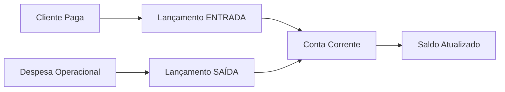

# 💰 Módulo Financeiro

## 📋 Visão Geral

Módulo responsável por gestão financeira, fluxo de caixa, contas bancárias, lançamentos e conciliação bancária.

---

## 📚 Documentação Disponível

| Documento | Descrição | Atualizado |
|-----------|-----------|------------|
| [CASH_FLOW_API_GUIDE.md](./CASH_FLOW_API_GUIDE.md) | 📘 Guia completo da API de Fluxo de Caixa | 2026-02-18 |
| [BANK_ACCOUNT_TYPES.md](./BANK_ACCOUNT_TYPES.md) | 🏦 Tipos de contas bancárias e configurações | 2026-02-18 |

---

## 🎯 Funcionalidades Principais

### ✅ Implementado
- **Contas Bancárias** - CRUD completo (corrente, poupança, caixa interno)
- **Fluxo de Caixa** - Lançamentos de entrada/saída
- **Categorias Financeiras** - Organização de receitas e despesas
- **Saldo Consolidado** - Visão por conta e global
- **Multi-tenant** - Isolamento financeiro por empresa
- **Auditoria** - Rastreamento completo de transações
- **Validações** - Impedimento de duplicatas, saldos negativos

### 🚧 Roadmap
- [ ] Conciliação Bancária Automática (OFX/CNAB)
- [ ] Relatórios Gerenciais (DRE, Fluxo de Caixa Projetado)
- [ ] Integração com Bancos (Pix, Boletos)
- [ ] Previsão de Receitas/Despesas
- [ ] Dashboard Financeiro
- [ ] Exportação de relatórios (Excel, PDF)

---

## 🔗 Referências Relacionadas

**Arquitetura:**
- [../ARCHITECTURE_ACTUAL.md](../ARCHITECTURE_ACTUAL.md) - Arquitetura do sistema
- [../REFACTORING_GUIDE.md](../REFACTORING_GUIDE.md) - Padrões de código

**Outras Features:**
- [../invoices/](../invoices/) - Faturamento e pagamentos de clientes
- [../contracts/](../contracts/) - Contratos e planos
- [../auth/](../auth/) - Permissões financeiras (FINANCIAL role)

**API:**
- [../API_README.md](../API_README.md) - Documentação geral
- [../requests.http](../requests.http) - Exemplos HTTP

---

## 🛠️ Endpoints Principais

### Contas Bancárias
```
GET    /api/bank-accounts           - Listar contas
POST   /api/bank-accounts           - Criar conta
GET    /api/bank-accounts/{id}      - Buscar conta
PUT    /api/bank-accounts/{id}      - Atualizar conta
DELETE /api/bank-accounts/{id}      - Desativar conta
GET    /api/bank-accounts/{id}/balance - Saldo atual
```

### Lançamentos (Transações)
```
GET    /api/transactions            - Listar lançamentos
POST   /api/transactions            - Criar lançamento
GET    /api/transactions/{id}       - Buscar lançamento
PUT    /api/transactions/{id}       - Atualizar lançamento
DELETE /api/transactions/{id}       - Excluir lançamento
GET    /api/transactions/summary    - Resumo financeiro
```

### Categorias
```
GET    /api/categories              - Listar categorias
POST   /api/categories              - Criar categoria
PUT    /api/categories/{id}         - Atualizar categoria
DELETE /api/categories/{id}         - Excluir categoria
```

---

## 🏦 Tipos de Contas Bancárias

| Tipo | Código | Uso |
|------|--------|-----|
| Conta Corrente | `CHECKING_ACCOUNT` | Conta bancária principal |
| Poupança | `SAVINGS_ACCOUNT` | Reserva financeira |
| Caixa Interno | `CASH_INTERNAL` | Dinheiro em espécie |
| Cofre | `SAFE` | Dinheiro guardado fisicamente |

Detalhes: [BANK_ACCOUNT_TYPES.md](./BANK_ACCOUNT_TYPES.md)

---

## 💡 Regras de Negócio

### Validações
- ✅ Não permitir saldo inicial negativo
- ✅ Lançamentos devem ter conta de origem válida
- ✅ Transferências requerem conta origem e destino diferentes
- ✅ Multi-tenant: cada empresa vê apenas suas contas

### Cálculo de Saldo
```
Saldo Atual = Saldo Inicial + Σ Entradas - Σ Saídas
```

### Auditoria
- ✅ Todos os lançamentos registram `created_by` (usuário)
- ✅ Timestamps automáticos (`created_at`, `updated_at`)
- ✅ Histórico de alterações (futuro)

---

## 📊 Exemplo de Fluxo



---

## 🧪 Testes

```bash
# Criar conta bancária
curl -X POST http://localhost:8080/api/bank-accounts \
  -H "Authorization: Bearer TOKEN" \
  -H "Content-Type: application/json" \
  -d '{
    "name": "Caixa Principal",
    "accountType": "CASH_INTERNAL",
    "initialBalance": 10000.00
  }'

# Criar lançamento de entrada
curl -X POST http://localhost:8080/api/transactions \
  -H "Authorization: Bearer TOKEN" \
  -H "Content-Type: application/json" \
  -d '{
    "bankAccountId": 1,
    "amount": 500.00,
    "transactionType": "INCOME",
    "description": "Pagamento Cliente X"
  }'
```

Mais exemplos: [CASH_FLOW_API_GUIDE.md](./CASH_FLOW_API_GUIDE.md)

---

## 🔐 Permissões

| Role | Permissões |
|------|-----------|
| **ADMIN** | Acesso total |
| **FINANCIAL** | CRUD completo de contas e lançamentos |
| **OPERATOR** | Criar lançamentos, visualizar relatórios |
| **VIEWER** | Apenas visualização |

---

**📅 Última atualização:** 2026-02-18  
**👤 Responsável:** Backend Team  
**🔄 Status:** ✅ Produção

